# In the name of God
# MelodyHub
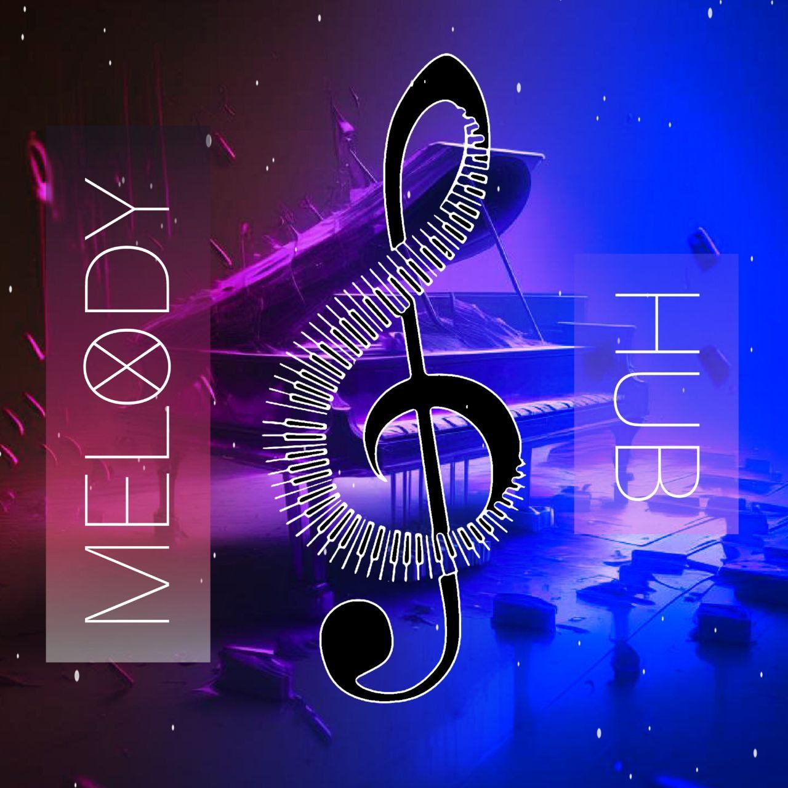
------------------------

This undertaking represents the culmination of an extensive and arduous effort, fraught with numerous challenges and obstacles encountered during the implementation phase. Our team, consisting of myself [Saba Madadi 🙃](https://github.com/sabamadadi) and my esteemed colleagues [Erfan Elmtalab 😎](https://github.com/E-ELMTALAB) and [Seyed 😎](https://github.com/seyed0123), has devoted countless hours and resources to the development of this project, utilizing a variety of programming languages including Java, Python, and C++.

Over the course of approximately one month, we have persevered through setbacks and difficulties, consistently pushing ourselves to produce the highest-quality result possible. The fruits of our labor are now available for your review and consideration.

As a viewer of this project, I implore you to lend us your support by bestowing us a single-star rating. This small gesture would not only serve as a testament to the hard work and dedication put forth by myself and my team but also provide us with invaluable feedback for future endeavors. Thank you for your time and attention to this matter.

------------------------------

# Intrudoction

MelodyHub is a comprehensive music player application that has been developed using a combination of [Java](https://www.java.com/en/download/help/whatis_java.html), [Python](https://www.python.org/doc/essays/blurb/), [C++](https://sefiks.com/2018/08/06/deep-face-recognition-with-keras/), and [Flutter](https://sefiks.com/2018/08/06/deep-face-recognition-with-keras/) technologies. The application offers a wide range of features that cater to the needs of music enthusiasts, including song playback, playlist creation, search functionality, artist and podcaster access, adding favorites, and playing songs from playlists.

In addition, MelodyHub also offers personalized song recommendations based on user behavior and listening history, ensuring that users are always up-to-date with the latest music trends and releases. Users can also share songs and playlists with others, follow other users, and view their followers and followings within the app.

The application has been designed to be user-friendly and accessible on both desktop and mobile devices, enabling users to enjoy a seamless music listening experience regardless of their device. With its extensive features and personalized recommendations, MelodyHub is the ultimate music player application for music lovers of all levels.

# Description

This project consists of four different sections :
Server , Client , Database , Recommendation Engine

let's go through all the different sections and see what role do they play in the project

## Server

The application utilizes two separate servers for different functionalities. The first server handles the generation and delivery of temporary passwords during the login process. This server ensures that users receive the necessary credentials securely and reliably.

The second server is responsible for various operations, including song downloading, extraction of song images, handling follow functionalities, managing playlist creation, processing song information requests, and more. It serves as a central hub for multiple tasks related to the application's core functionalities.

To ensure data security, modern encryption methods such as AES (Advanced Encryption Standard) and RSA (Rivest-Shamir-Adleman) are employed. AES is a symmetric algorithm designed for efficient data encryption and decryption, while RSA is an asymmetric method primarily used for secure key exchange and digital signatures. These encryption techniques enhance the confidentiality and integrity of sensitive information.

Moreover, all user passwords and essential information are stored using secure hash methods. Hashing algorithms convert sensitive data into unique hash values, making it computationally infeasible to retrieve the original information from the hash. This further safeguards user passwords and essential data from unauthorized access.

By employing these encryption and hashing techniques, the application ensures a robust security framework, protecting user information and enhancing overall data privacy.

The system has been designed to log information in a way that allows it to be used through the program code itself, even in the event of a database loss. This ensures that critical information is always available and can be easily accessed when needed.

## Client

The client interface is the part of the application that users interact with. It offers a variety of functions to users, such as playing songs, sharing songs and playlists, following other users, displaying popular and recommended songs, accessing premium status, liking songs, creating playlists, and downloading songs.

Users can search for specific songs or add popular songs to their playlists or queue for playback and enjoyment. To access premium status, users must play a game of Pac-Man, which is implemented in C++ and the Pacman has been designed to run on the Docker platform, enabling universal accessibility of the program for all users. This feature allows for greater flexibility and ease of use, as users are no longer bound by the limitations of their individual operating systems or hardware configurations. If they achieve a score above a specified threshold, they unlock the premium status. With premium status, users can follow other users, view their followers and followings, and search for individuals within the application to follow.

The client interface is designed to be user-friendly and provides a range of features that enhance the overall music listening and social interaction within the application.
In addition to the features mentioned, the client interface also allows users to create and share playlists with other users, as well as like and comment on other user's playlists. This fosters a sense of community within the application and allows users to discover new music and connect with others who share similar tastes.

Another notable feature of the client interface is its recommendation system, which suggests songs and playlists based on a user's listening history and preferences. This helps users discover new music and ensures that they are always up-to-date with the latest trends and releases.

Overall, the client interface is designed to be intuitive and easy to use, with a clean and modern interface that is optimized for both desktop and mobile devices. By offering a wide range of features and functions, as well as fostering a sense of community and social interaction, it provides a complete music-listening experience for users of all levels.
### Admin Status Checker:

This Flutter app has been designed to enable admins to easily check the status of the main application. The app provides a user-friendly interface that displays real-time information on the performance and availability of the application, allowing admins to quickly identify and resolve any issues that may arise.

With the Admin Status Checker, admins can view detailed information on the status of key components of the main application, such as the database, server, and network connection. They can also receive alerts and notifications when issues are detected, enabling them to take immediate action to resolve any problems.
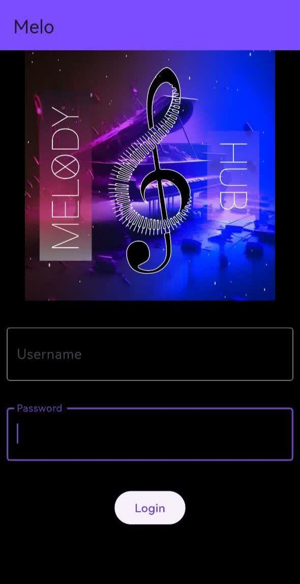
## class UMLs:
### objects
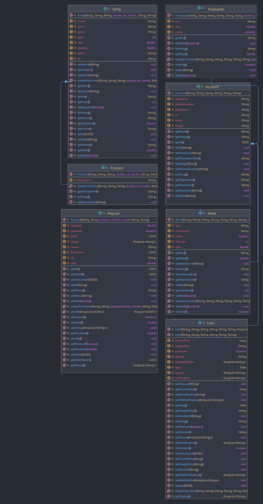
### Melody Server
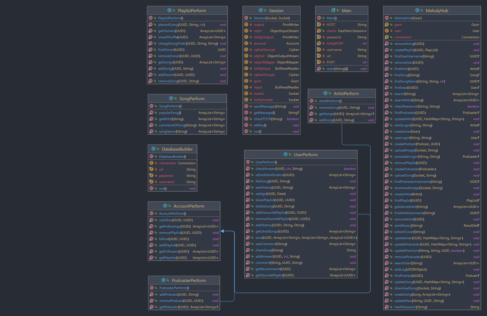
### Loxdy server
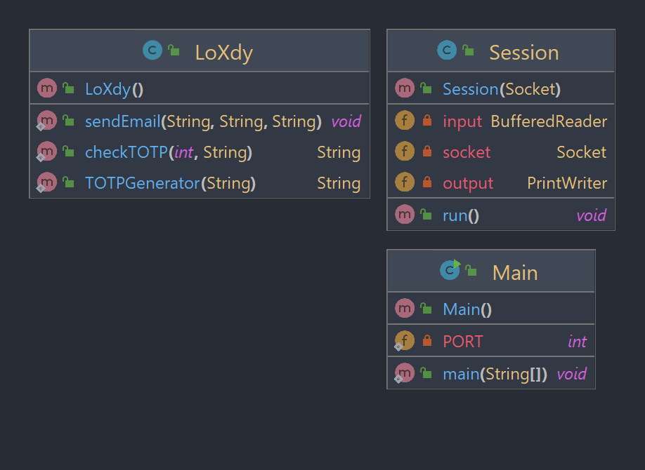

### Client
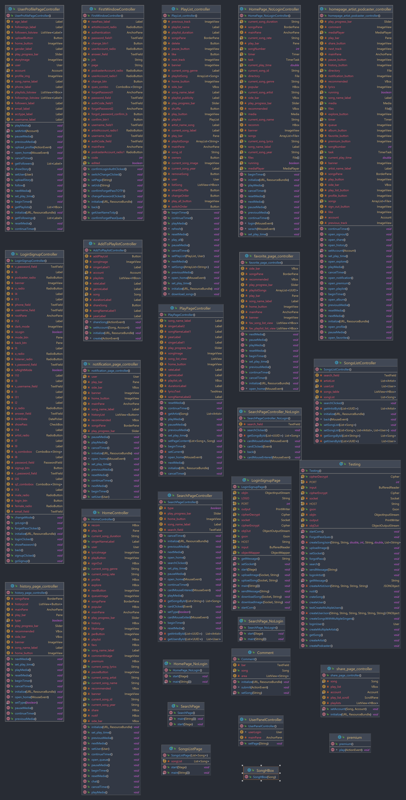
## Recommendation Engine
The system is composed of two main components: a recommendation engine and a genre classification system. The recommendation engine runs continuously, using machine learning algorithms to analyze user listening behavior and generate personalized song recommendations. Whenever a user listens to more than four songs within a specified period of time, the engine generates 15 song ID recommendations for that user and stores them in the database.

The genre classification system is responsible for ensuring that all songs in the database have accurate genre labels. When the recommendation engine generates new song recommendations, the genre classification system first checks if the recommended songs already have a genre assigned in the database. If they do, no further action is taken.

However, if the songs do not have a genre assigned, the genre classification system listens to each song and uses machine learning techniques to determine their respective genres. This process involves extracting audio features such as tempo, rhythm, and melody, and comparing them to a pre-defined set of genre templates. Based on this analysis, the system assigns one or more genre labels to each song, which are then added to the database accordingly.

By continuously analyzing user listening behavior and accurately labeling songs with their respective genres, the system is able to provide highly personalized and relevant song recommendations to users, enhancing their overall music listening experience. In addition, the system's ability to automatically classify songs with accurate genre labels also benefits music industry professionals, such as record labels and music distributors, who rely on accurate genre information to make informed decisions about marketing and distribution strategies.

## Databsae

The database used in the application is a comprehensive repository that stores a wide range of information related to the application's functionality. This includes information about users, such as their login credentials, personal details, and settings. It also includes information about artists and podcasters, such as their biographies, discographies, and other relevant details.

In addition, the database stores information about songs, including their titles, durations, genres, and other metadata. It also stores information about playlists, ownership details, shared content, and favorite items. User history is also recorded in the database, allowing users to easily access previously played songs or podcasts.

Notifications are also stored in the database, allowing users to view alerts and updates related to their account or the application itself. Song lyrics are another important piece of information that is stored in the database, allowing users to view lyrics while listening to a song.

Finally, the database stores information about user followers and followings, allowing users to connect and interact with other users who share similar tastes in music or podcasts.

The song table in the database is particularly noteworthy, as it contains over 588,000 unique song IDs along with associated information that users can listen to. This information includes details such as the song's title, artist, album, duration, and genre.

The database is populated with data before, during, and after the application's operation using Python and Java scripts. This ensures that the database is always up-to-date and accurate, reflecting the latest information about users, songs, and other relevant details. By providing a comprehensive repository of information, the database enables the application to provide a rich and engaging user experience, and ensures that users can easily find and listen to their favorite songs and podcasts.
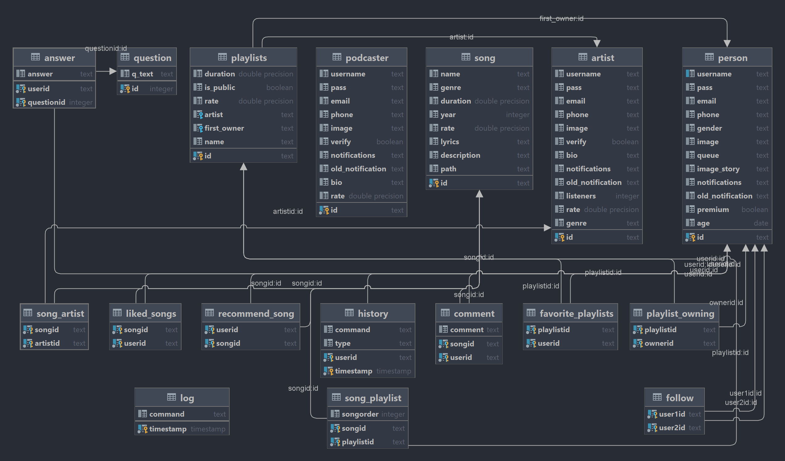

## Screenshots
Included below are several images showcasing the functionality  of the project
### Starting video
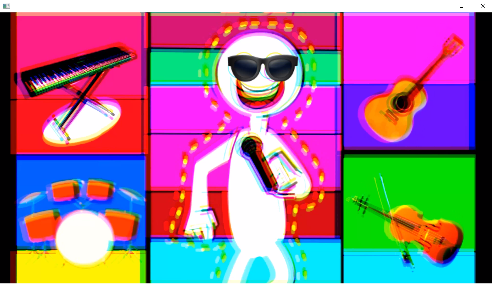
### A user that doesn't have a login
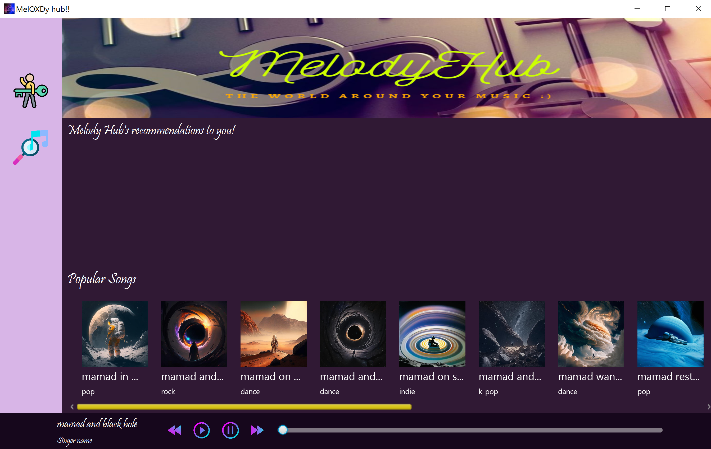
### Login page

### Forget password
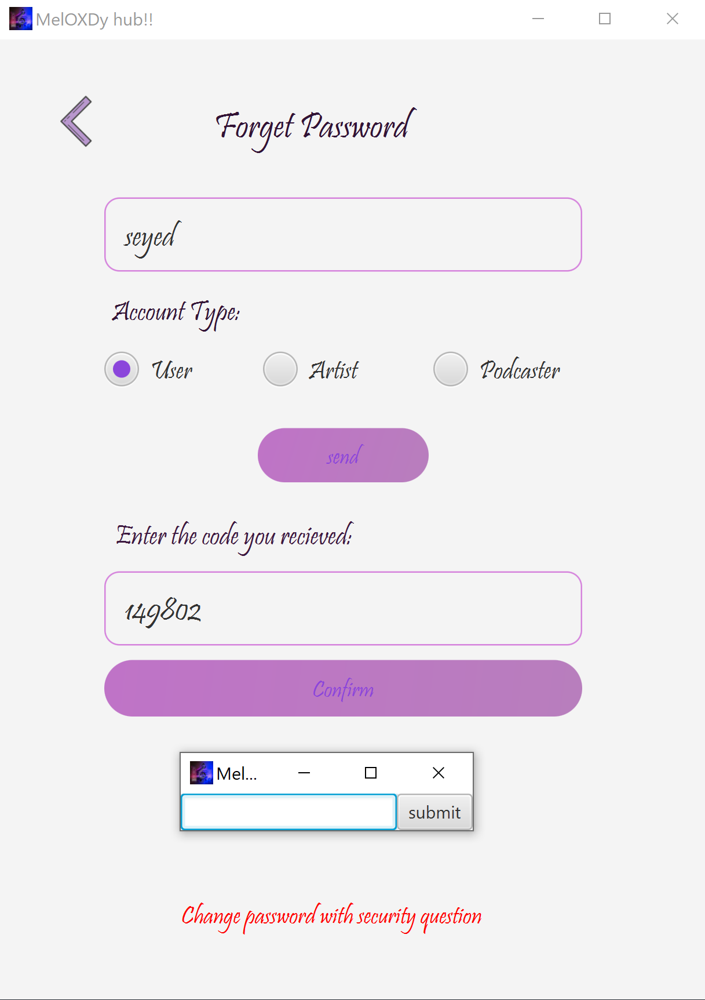
### Home page
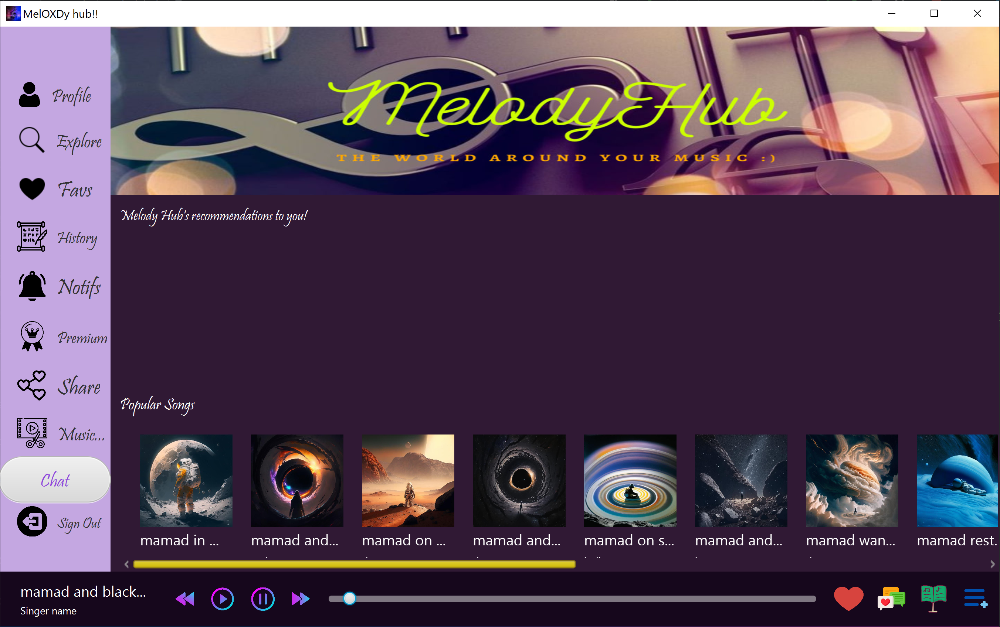
### Profile
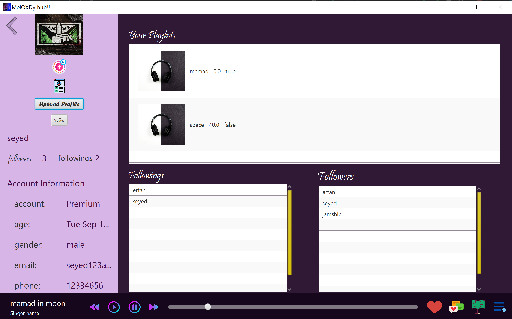
### Search

### Favorites

### History

### Premium
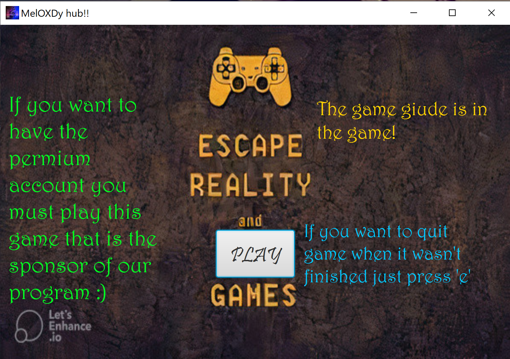

### Share
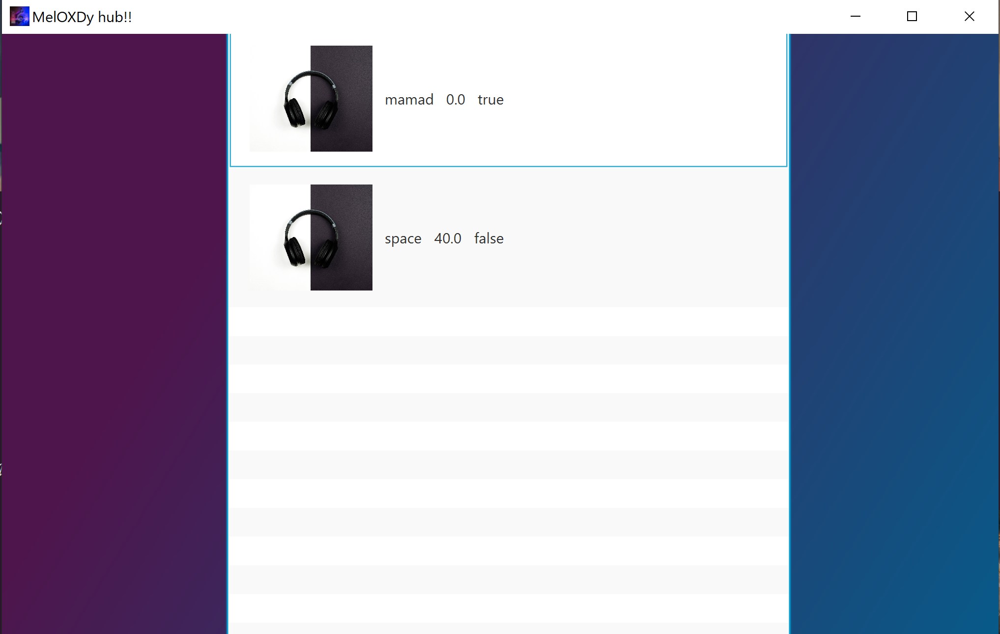
### Chat
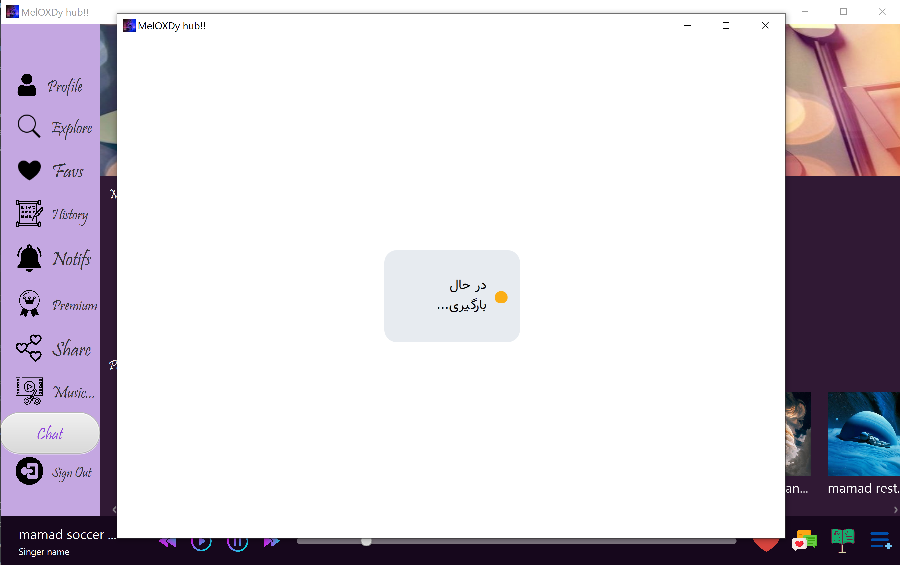
### Comment
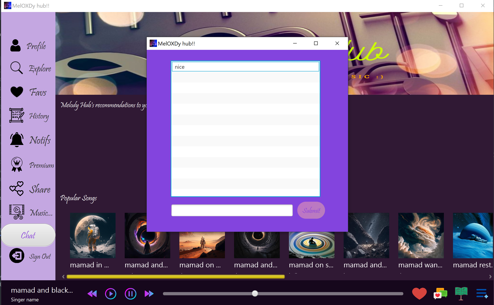
### Playlist

### PlayPage
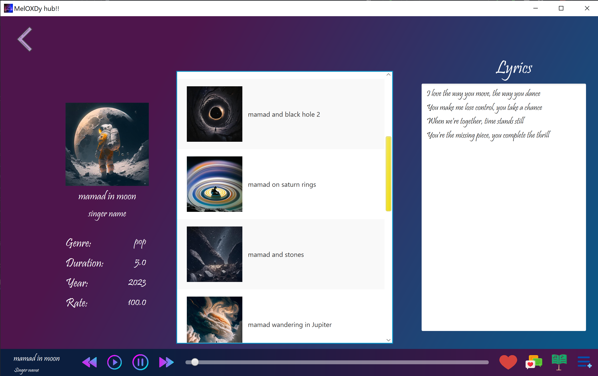
### Song panel
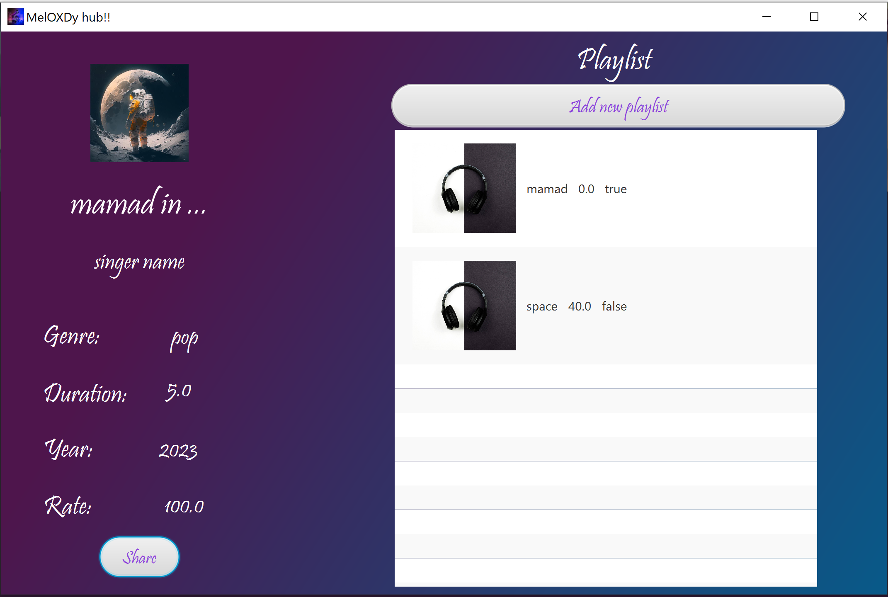

## Additional Features

- The application offers a light/dark mode toggle, allowing users to switch between different visual themes based on their preference.
- To assist users who have forgotten their passwords, a security question feature is implemented. Users can set up a security question during the account creation process, which can be used to reset the password in case it is forgotten.
- The project utilizes Cascading Style Sheets (CSS) to define the visual appearance and layout of HTML elements in the web pages. CSS is used extensively to style various elements, such as buttons, text, images, and forms, as well as create complex layout structures such as grids and flexboxes.
- In the event of a forgotten password, users can retrieve a temporary password by utilizing the email verification method. The temporary password remains valid for a duration of two minutes and is automatically refreshed afterward.
- Users have access to their browsing history within the application, enabling them to review and revisit previously played songs or content.
- Users can receive notifications when other users choose to follow them, promoting social interaction and engagement within the application.
- The search page allows users to explore and access songs. It also includes the option to filter search results by multiple genres, allowing users to specifically search within their preferred genres.
- Users have the ability to upload their own profile image, enabling personalization and customization of their user profile.
- Users can view and play playlists that have been shared with them by others, fostering a collaborative and shared music listening experience.
- The initial page of the application is designed for unlogged users. It features a section where users can log in to their accounts to gain full functionality and access within the application.
- If a specific song is not available within the application's library, users can still play the song by downloading it from the server on-demand. This ensures a wide range of song availability and a seamless listening experience.
- All communication between the client and server is established through the socket communication method, ensuring secure and efficient data exchange.
- Users can utilize the search page to find and search for other users within the application. Additionally, they have the option to follow other users, enhancing social connections and networking within the application.
- The application begins with a project-related video, providing an introduction and overview. Users can choose to remain in the unlogged state or proceed with logging in to access the full functionality and features of the application.
# Overall

Overall, MelodyHub is a robust and feature-rich music player application that provides users with a comprehensive music listening experience. The application offers a wide range of features, including song playback, playlist creation, search functionality, artist and podcaster access, adding favorites, and playing songs from playlists.

One of the standout features of MelodyHub is its personalized song recommendation system, which uses advanced algorithms to generate recommendations based on user behavior and listening history. This ensures that users are always up-to-date with the latest music trends and releases, and also helps them discover new music that aligns with their individual tastes and preferences.

In addition, MelodyHub allows users to share songs and playlists with others, follow other users, and view their followers and followings within the app. The application has been designed to be user-friendly and accessible on both desktop and mobile devices, enabling users to enjoy a seamless music listening experience regardless of their device.

Overall, MelodyHub is a powerful and versatile music player application that caters to the needs of music enthusiasts of all levels. Whether you're looking to discover new music, create personalized playlists, or simply enjoy your favorite songs, MelodyHub has everything you need to enhance your music listening experience.
